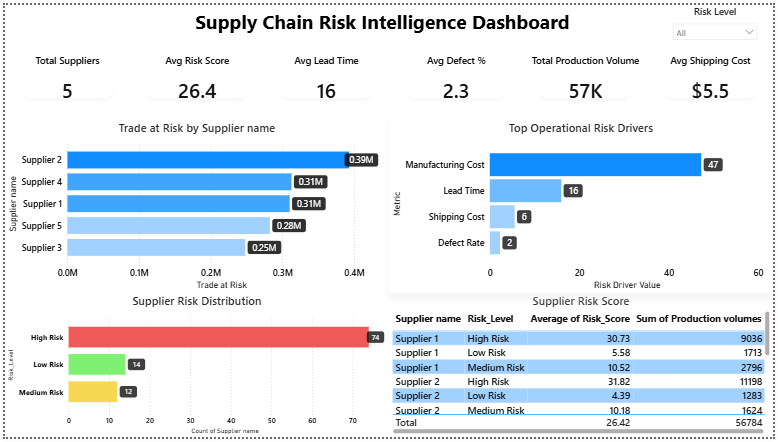
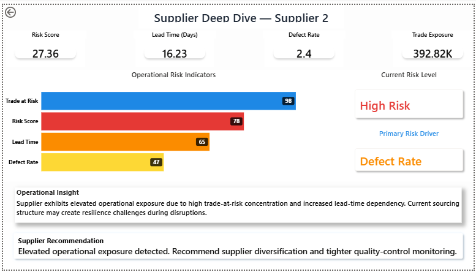
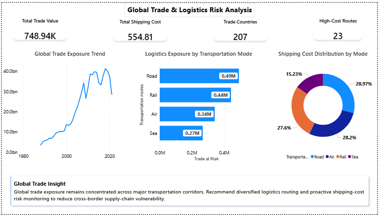

# Supply Chain Risk Intelligence System

## Executive Summary
The **Supply Chain Risk Intelligence System** is an enterprise-style Power BI analytics solution designed to monitor, evaluate, and visualize supplier risk, logistics exposure, operational instability, and global trade vulnerabilities.

This project transforms raw operational and trade datasets into interactive executive dashboards that support strategic decision-making, operational monitoring, and risk mitigation.

The solution provides centralized visibility into:
- Supplier performance and operational reliability
- Trade exposure concentration
- Transportation and logistics risk
- Shipping-cost volatility
- Lead-time dependency
- Production and operational disruptions

---

# Business Problem
Modern supply chains operate across highly interconnected global networks. Organizations frequently face challenges such as:

- Supplier dependency and concentration risk
- Rising logistics and transportation costs
- Operational delays and disruptions
- Trade volatility and cross-border exposure
- Limited visibility into supplier performance
- Difficulty identifying early operational risk signals

Without centralized intelligence, organizations struggle to proactively identify vulnerabilities and make data-driven operational decisions.

This project addresses those challenges through a Power BI-driven risk intelligence platform.

---

# Project Objective
The objective of this project is to build an interactive Power BI dashboard capable of:

- Monitoring supplier risk exposure
- Identifying operational bottlenecks
- Tracking logistics and shipping vulnerabilities
- Analyzing trade concentration and volatility
- Supporting executive-level strategic planning
- Delivering actionable operational insights

---
## Dashboard Preview

### Home Dashboard

### Supplier Deep Dive

### Global Trade & Logistics Analysis

---

# Dashboard Architecture

## 1. Supply Chain Risk Intelligence Overview
Executive-level overview dashboard providing:

### Key KPIs
- Total Suppliers
- Average Risk Score
- Average Lead Time
- Average Defect Percentage
- Total Production Volume
- Average Shipping Cost

### Analytical Visuals
- Supplier Risk Distribution
- Trade-at-Risk Analysis
- Top Operational Risk Drivers
- Supplier Performance Table

### Business Value
Provides management with a centralized overview of operational risk exposure and supplier performance.

---

## 2. Supplier Risk Deep Dive
Drill-through analytical page designed for supplier-level operational analysis.

### Features
- Supplier-specific KPI metrics
- Operational risk indicators
- Current risk-level classification
- Primary operational risk driver identification
- Dynamic operational insights
- Supplier recommendations and mitigation guidance

### Business Value
Enables detailed investigation of high-risk suppliers and supports operational intervention planning.

---

## 3. Global Trade & Logistics Risk Analysis
Global logistics and trade exposure analysis dashboard.

### Key Insights
- Global trade exposure trends
- Transportation mode exposure analysis
- Shipping-cost distribution by transportation mode
- Trade-country exposure overview
- Logistics operational insights

### Business Value
Supports strategic trade planning and logistics risk mitigation.

---

# Core Business Questions Addressed
The dashboard was designed to answer critical operational and strategic business questions such as:

1. Which suppliers carry the highest operational risk?
2. What factors are causing delays and disruptions?
3. Which transportation modes create maximum exposure?
4. Where is trade concentration highest?
5. Which operational drivers increase supply-chain vulnerability?
6. Which suppliers require immediate intervention?
7. How can organizations improve resilience and reduce operational exposure?

---

# Data Sources
The project integrates multiple operational and trade datasets including:

- Supplier operational datasets
- Trade exposure datasets
- Logistics and transportation data
- Shipping cost metrics
- Production-volume records
- Lead-time and operational performance data
- Risk indicators and supplier scoring datasets

---

# Data Preparation & Transformation
Data preparation was performed using **Power Query** and included:

- Data cleaning and transformation
- Duplicate removal
- Missing-value handling
- Data-type validation
- Relationship creation
- Data modeling
- Data normalization and formatting

The project also involved:
- Exploratory Data Analysis (EDA)
- Operational trend analysis
- Risk pattern identification
- Supplier performance evaluation

---

# Data Modeling
A structured Power BI data model was created to support interactive filtering and drill-through analysis.

### Data Modeling Features
- Relationship creation across supplier and trade datasets
- DAX-based KPI calculations
- Dynamic measures and calculated fields
- Cross-filter interaction management
- Drill-through functionality for supplier analysis

---

# DAX Measures & KPIs
The dashboard uses multiple DAX measures to generate dynamic insights including:

- Total Trade Value
- Average Risk Score
- Average Shipping Cost
- Average Lead Time
- High Risk Supplier Count
- Trade-at-Risk Metrics
- Production Volume Metrics
- Supplier Efficiency Scores
- Logistics Exposure Indicators
- Operational Risk Drivers

---

# Key Business Insights
The analysis revealed several critical operational insights:

- Trade exposure is concentrated across a limited number of operational corridors
- Road and rail transportation modes contribute significantly to logistics exposure
- Supplier dependency increases operational vulnerability
- Lead-time fluctuations strongly influence operational risk
- Shipping-cost volatility impacts supply-chain resilience
- High-risk suppliers require proactive operational monitoring

---

# Tools & Technologies Used

| Technology | Purpose |
|---|---|
| Power BI Desktop | Dashboard Development |
| Power Query | Data Cleaning & Transformation |
| DAX | KPI & Measure Creation |
| Excel | Dataset Source |
| Data Modeling | Relationship Management |

---

# Key Features
- Interactive Power BI dashboards
- Executive KPI reporting
- Dynamic drill-through analysis
- Operational risk monitoring
- Supplier-level insights
- Logistics exposure analysis
- Trade trend visualization
- Business-focused storytelling
- Executive-ready dashboard design

---

# Project Workflow
1. Dataset Understanding
2. Data Validation
3. Data Cleaning
4. Missing Value Handling
5. Relationship Creation
6. Data Modeling
7. KPI & DAX Development
8. Dashboard Design
9. Business Insight Generation
10. Executive Reporting

---

# Project Outcome
The final solution delivers a centralized supply-chain intelligence platform capable of:

- Supporting strategic planning
- Improving operational visibility
- Monitoring supplier exposure
- Enhancing logistics decision-making
- Identifying operational bottlenecks
- Enabling data-driven risk mitigation

This project demonstrates practical expertise in:

- Business Intelligence
- Data Analytics
- Dashboard Design
- DAX Development
- Power Query Transformation
- Executive Reporting
- Operational Risk Analysis

---

# Skills Demonstrated
- Power BI Dashboard Development
- Data Transformation & Cleaning
- DAX Calculations
- Data Modeling
- Risk Analytics
- Business Intelligence Reporting
- Operational Analytics
- Executive Dashboard Design
- Data Storytelling

---

# Future Enhancements
Potential future improvements include:

- Real-time API integration
- Predictive risk modeling
- AI-driven anomaly detection
- Supplier forecasting models
- Live logistics monitoring
- Automated alert systems
- Geographic risk heatmaps

---

# Author
## Anirudh Shukla

Power BI Developer | Data Analyst | Business Intelligence Enthusiast

---

# Conclusion
The Supply Chain Risk Intelligence System demonstrates how Business Intelligence tools can transform operational and trade data into actionable strategic insights.

The project combines:
- operational analytics,
- supplier intelligence,
- logistics exposure analysis,
- and executive reporting

into a centralized Power BI solution designed to support smarter supply-chain decision-making.
